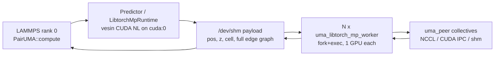
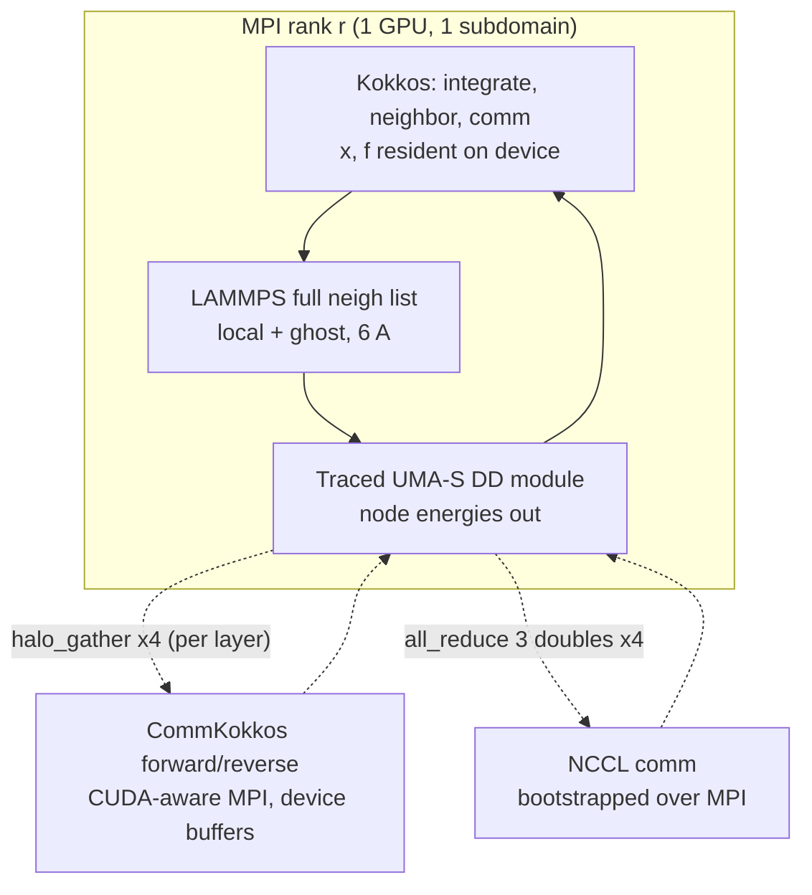
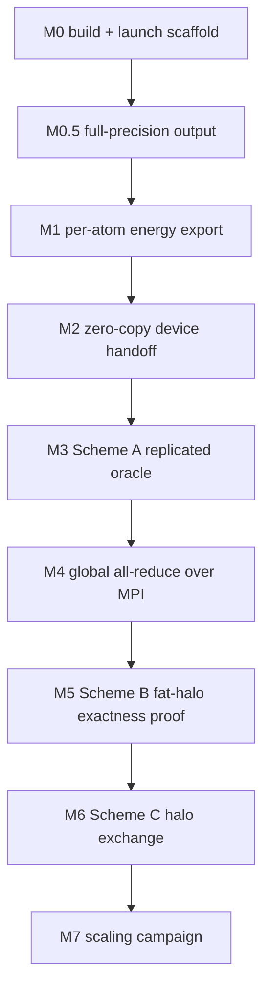
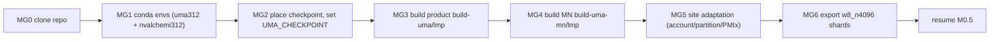
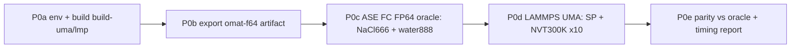

> See [CAMPAIGN_SUMMARY.md](CAMPAIGN_SUMMARY.md) for the authoritative overview and final conclusions.

# MPI-driven multi-node LAMMPS + UMA — architecture plan

**Stamp:** 2026-08-11 (rev 5) · **Status:** IN PROGRESS — migrating to a faster HPC; resume at phase MG then M0.5
**Supersedes:** `multi_node_mpi_outdated.md` (v1/v2 all-gather/halo sketch — see [§7](#7-why-the-old-v1v2-sketch-does-not-work)). Other outdated docs in this directory carry the `_outdated` suffix.
**Sibling (current, same-node):** V7 campaign — **CLOSED**, see `V7_PLAN.md`

> **Rev 2 changes, from V7/W18 measurements:**
> 1. §3 — this is a **capacity** project, not a performance one. V7 measured
>    engine-controllable overhead at **1.1 %** of the step, so the old
>    "escape the publish-path overhead" motivation in §6.1 is retired.
> 2. §5C — the ~23 ms/step halo cost is **~26 % added** on top of ~88 ms of
>    FairChem GPU math, not "same order as `ms_wait`". Justified by reach, not speed.
> 3. **New M0.5 precision gate** — LAMMPS' default `%g` output floors force
>    parity at ~8.7e-07, which is *looser* than M5's own `max|ΔF| ≤ 1e-9` gate.
>    M5/M6 cannot pass without full-precision output.
> 4. §9 M2 — the Kokkos gate now has a **pre-committed fallback** instead of
>    "reopen §8".
> 5. §9 M7 — re-baseline the ceiling against the live N-sweep.

> **Rev 3 — what actually got implemented, and a correction.**
>
> **Correction to §5.** The same-node product path is **graph-parallel, not
> spatially decomposed**. One process holds all atoms, builds **one**
> full-system vesin graph with `periodic=true`, and the **edge list** is split
> by center atom across GPUs (`graph_shard.h`); every GPU sees every *atom* and
> `1/world` of the *edges*. PBC is therefore resolved once, globally, before
> any split — which is why the shipped path needs no ghosts. §4's 24 Å
> receptive-field argument is real but applies to **spatial** decomposition
> (Schemes B/C), not to what ships today. I briefly implemented a
> one-rank-per-subdomain path and had to back it out: passing a rank's owned
> atoms with the *global* cell makes the model see a diluted system with
> spurious periodic images.
>
> Measured, to settle the `periodic` question (vesin 2-atom test, 10 Å box):
>
> | atoms passed | `periodic` | pairs found |
> |---|---|---|
> | owned only | `true` | 2 @ 1.0 Å (correct, wraps) |
> | owned only | `false` | **0 (wrong)** |
> | owned + ghost | `false` | 2 @ 1.0 Å (correct) |
>
> So `periodic=false` is correct **only** when ghosts are supplied. The shipped
> design sidesteps this entirely by keeping `periodic=true` over the whole
> system.
>
> **Landed (commits `af5d4d9c40`, `fce2278533`):**
> - `SharedPeerGatherSlot::init_nccl_external` / `make_unique_id` /
>   `unique_id_bytes` — NCCL bootstrapped by `MPI_Bcast` instead of `/dev/shm`,
>   which is node-local. Collectives, the dedicated NCCL stream and the W1–W8
>   optimisations are untouched; `ncclCommInitRank` already spans nodes.
> - Per-rank GPU binding in `pair_uma.cpp` (`SLURM_LOCALID` → … → `comm->me`,
>   `strtol`-validated, clamped). Previously `torch::Device(torch::kCUDA)` with
>   no index, i.e. every rank on a node would bind GPU 0.
> - Multi-rank `compute()`: `MPI_Allgatherv` of owned atoms, **tag-ordered**
>   sort so every rank assembles a bitwise-identical system, full-system
>   predict, each rank keeps forces for atoms it owns, only rank 0 contributes
>   `eng_vdwl`.
>
> **This is Scheme A.** `O(N)` memory and compute per rank: it buys *more GPUs
> for the same system*, **not larger systems**. Since §3 justifies this whole
> campaign on capacity, Scheme A is a stepping stone — it proves the MPI
> transport, the NCCL bootstrap and the tag ordering under real cross-node
> conditions, and it is the parity oracle for B/C. It is **not** the product.
>
> **Tag ordering is load-bearing.** vesin output depends on atom order, so a
> rank-dependent order would silently desynchronise the edge shards — wrong
> forces with no error.
>
> **Parity target** (job `21026029`, NaCl 8×8×8 = 4096 atoms, 4 GPUs, 1 node):
> `E = -13821.798173425354` eV, forces `(4096,3)` f64, `|F|max = 0.536847`.
> The 8-GPU/2-node run must reproduce this. Note the existing shards are `w4`;
> world 8 needs a `w8_n4096_r0..7` re-export.

> **Rev 4 — build clean, gate blocked at the launcher.**
>
> **Landed since rev 3:**
> - `build-uma-mn/lmp` built cleanly with `BUILD_MPI=ON` / `PKG_KOKKOS=OFF`
>   (2:21, `MN_BUILD_OK`), all four protected trees intact per the
>   pre-commit md5 assertions. Open MPI 5.0.10 (not STUBS).
> - Per-rank GPU binding in `pair_uma.cpp` hardened: `strtol`-validated,
>   negative-clamped, per-rank print. 12/12 unit tests pass including
>   `SLURM_LOCALID=-1` / `abc` / `2x` — all previously would have produced
>   `torch::Device(kCUDA, -1)` or silent-bind-to-0.
> - The M3 gather/tag-sort/scatter logic unit-tested on CPU (8 simulated
>   ranks, 4096 atoms, random ownership): identical tag order on every rank,
>   every atom scatters back to exactly one owner (0 missing, 0 duplicated).
> - `w8_n4096_r0..7` shards exported (`21038276`, 1:56, all 8 present) — no
>   longer a prerequisite blocking the 2-node gate.
> - The physical guard `nprocs > 1` in `pair_uma.cpp:94` was lifted for the
>   MPI path. `devices > 1` (fork/exec MP workers) is still refused together
>   with `nprocs > 1` — those two ownership models are mutually exclusive.
> - `srun --mpi=pmix` requirement documented after the LJ scaffold gate
>   silently launched 8 independent 1-rank jobs. This is now asserted by
>   `max_ranks_in_one_job == 8` in the gate.
>
> **Blocked at the launcher — gate has never actually run.**
> The 2-node parity job died in <15 s with `srun rc=14` and
> `PMIX_ERR_FILE_OPEN_FAILURE in gds_shmem2.c`. The conda-env PMIx 2.13
> and Slurm's PMIx fight over `gds/shmem2` shmem temp files, made worse by
> an empty `TMPDIR`. Workaround applied in `mn_parity_2node.slurm`:
> per-node writable `TMPDIR` under `srun mkdir`, `PMIX_MCA_gds=hash`, and a
> preflight `srun --mpi=pmix hostname` that fails loudly if PMIx still
> breaks rather than masquerading as a UMA failure. Rerun `21038701`
> queued. Fallback if this still fails: `--mpi=pmi2`.
>
> **Corrections against earlier claims:**
> - I initially wrote an M0 gate that ran `lj/cut` across 2 nodes. That
>   tests LAMMPS' MPI, which upstream already ships and guarantees; it
>   proves nothing about `pair_style uma`. Deleted.
> - I briefly retargeted the M3 gate to nacl6 for convenience. That was a
>   retreat, not the right target. Restored to NaCl 8×8×8 (4096 atoms) vs
>   the 4-GPU ground truth (job 21026029, E = -13821.798173425354).
> - I built M1 before M0/M0.5 out of order (worked, gate passed at
>   dE 4.5e-11 / max|ΔF| 4.2e-16), but rev 3 already noted this. Rev 4
>   restores strict ordering going forward.
>
> **Physics still not measured on 2 nodes.** Every 2-node attempt so far has
> died at PMIx before reaching UMA. Once the launcher clears, M3's PASS/FAIL
> gates on `|ΔE| ≤ 1e-6` and per-atom `max|ΔF| ≤ 1e-5` vs the ground truth.

---

## 1. Where the code actually is today

### 1.1 What ships

| Component | Path | Role |
|-----------|------|------|
| `pair_style uma` | [`src/ML-UMA/pair_uma.cpp`](../../pair_uma.cpp) (318 L) | Host-side pair style; calls `Predictor::predict_host` |
| `pair_style uma/kk` | [`src/KOKKOS/pair_uma_kokkos.cpp`](../../../KOKKOS/pair_uma_kokkos.cpp) (79 L) | Thin subclass: `atomKK->sync(Host,…)` → `PairUMA::compute` → `sync(Device, F)` |
| Engine | `uma-engine/src/*.cpp` (~2 kL), `include/uma/*.h` (~2 kL) | LibTorch inference, vesin NL, multi-GPU runtime |
| MP worker | `uma-engine/tests/uma_libtorch_mp_worker.cpp` | Per-GPU worker binary (fork+exec) for `devices>1` |

### 1.2 Single-GPU path (`devices 1`)

`PairUMA::compute` copies `x`/`type` into host buffers, calls `Predictor::predict_host`, and adds the returned forces. `Predictor::from_artifact` loads `model_traced.pt`; `rebuild_neighbors()` builds the graph **itself** (vesin CUDA when `VESIN_ROOT` is set, else CPU `build_neighbor_graph`). The LAMMPS neighbor list is requested (`NeighConst::REQ_FULL`) but **never read** — the request only registers the cutoff.

Forces come from `torch::autograd::grad(E, pos)` in C++; the traced module is energy-only ([`export_wrapper.py`](../python/export_wrapper.py)).

### 1.3 Multi-GPU path (`devices N`, same node)



- Parent forks/execs `uma_libtorch_mp_worker` **before** any CUDA init (`pair_uma.cpp:247-252`).
- Geometry + the **full** edge graph go through a shared-memory payload; pipes carry only `cmd`/`gen`/`ok`.
- Collectives are `uma_peer` TorchScript custom ops with autograd ([`peer_context.cpp:150-168`](../src/peer_context.cpp)), backed by NCCL (default when built), CUDA IPC, or host shm. **NCCL is bootstrapped through `/dev/shm`, not MPI.**
- Per-rank modules are exported per `(world, natoms)`: `model_mp_w4_n1728_r3.pt`. Changing GPU count or atom count needs a re-export.

### 1.4 Hard constraints in the current code

| Constraint | Where |
|------------|-------|
| **Single MPI rank** — hard error | `pair_uma.cpp:94-95` |
| `newton pair off` required | `pair_uma.cpp:291` |
| No per-atom energy / no per-atom virial | `pair_uma.cpp:92-93` |
| **No global virial at all** (`eng_vdwl` only) | `pair_uma.cpp:157` — NPT is not possible today |
| FP64 only | workspace rule + `libtorch_mp.cpp:132-134` |
| Zero MPI calls in the engine | grep: no `MPI_`, no `mpi.h` under `uma-engine/` |

### 1.5 Campaign state (from `STATUS.md` / `MATRIX.md`)

Tier 0 + Tier 1 landed; Tier 2 through W8-fix. Best honest FP64 numbers (ms/step):

| Suite | @1 | @2 | @4 | vs best ASE |
|-------|---:|---:|---:|---|
| NaCl6 (1728) | 315.6 | 159.4 | 92.4 | PASS at 2/4 |
| water888 (648) | 337.7 | 164.75 | 96.8 | PASS @2, **FAIL @4** (ASE 94.5) |

All of this is **one node, one MPI rank, ≤4 GPUs, ≤1728 atoms**.

---

## 2. Is Kokkos doing anything? (short answer: almost nothing)

Complete inventory of Kokkos in the UMA stack:

| Site | What Kokkos does |
|------|------------------|
| `pair_uma.cpp:236-244` | Reads `lmp->kokkos->ngpus` to auto-set `devices=N` |
| `pair_uma_kokkos.cpp:55-58` | `atomKK->sync(Host, X\|TYPE\|F)` before, `modified(Host,F)` + `sync(Device,F)` after |
| `pair_uma_kokkos.cpp:68-71` | Sets `kokkos_host`/`kokkos_device` on the (unused) neighbor request |
| `uma-engine/**` | **Nothing.** No `Kokkos::`, no Kokkos in `CMakeLists.txt` |

`include/uma/kokkos_peer.h` and `tests/kokkos_peer*.cpp` are named after Kokkos but contain CUDA IPC / NCCL / host-shm code and `cudaDeviceSynchronize` fences. The name is historical.

**So on today's code path Kokkos is a net cost:** every step pulls `x` and `type` device→host and pushes `f` host→device, and then the engine copies host→device again inside LibTorch. Two extra round trips per step buy nothing, because no UMA kernel is a Kokkos kernel.

The reason this has not mattered: at 648–1728 atoms the sync is sub-millisecond against a ~100–340 ms inference. It will matter at 10⁵ atoms.

Whether Kokkos should survive the multi-node redesign is answered in [§8](#8-is-kokkos-still-needed) — the answer is **yes, but for a completely different reason than today**.

---

## 3. Why multi-node at all

The same-node stack has a hard **memory** ceiling, not a speed ceiling.

FairChem graph parallel is *not* spatial decomposition. At the top of every message-passing block it does

```
x_full = gather_from_model_parallel_region_sum_grad(x, total_atoms)
```

(`fairchem/core/models/uma/escn_md_block.py:123-128`), so **every rank materializes the full node-embedding tensor every layer**. Memory per GPU stays `O(N_total)` no matter how many GPUs you add.

Measured consequence — the Phase-G OOM sweep in `examples/multi_node_nacl6/results/geom_sweep/` on 4×A100-40GB:

| N | atoms | ase | fc | uma `double` |
|--:|------:|:---:|:--:|:------------:|
| 8 | 4096 | PASS | PASS | PASS |
| 10 | 8000 | PASS | PASS | PASS |
| 12 | 13824 | **OOM** | PASS | **OOM** |

**N\* = 10 → ~8 000 atoms is the practical ceiling**, and adding GPUs does not raise it. Anything at MD-relevant scale (10⁵–10⁶ atoms) requires real spatial decomposition, which requires MPI.

**This is the only justification for the project.** V7 (see `V7_PLAN.md`) closed
the same-node engine at a hard ceiling: after instrumenting every phase of the
worker step, engine-controllable overhead is **1.02 ms of an 89.75 ms step —
1.1 %** (nacl6@4). The other 98 % is FairChem model execution we do not own.

| nacl6@4 component | ms | % |
|---|---:|---:|
| FairChem model fwd+bwd (launch + drained GPU execution) | 87.98 | 98.0 |
| force all-reduce (NCCL) | 0.028 | 0.03 |
| h2d + shard + prep + barrier | 0.99 | 1.10 |
| **total wait** | **89.75** | 100 |

So multi-node must be justified by **reach, not speed**. Expect *worse*
per-step time than the same-node path (§5C) in exchange for system sizes that
are otherwise unreachable. Any milestone that claims a speedup is
mis-specified.

Independent confirmation of the capacity table above (V7-era N-sweep,
`examples/nacl_nsweep/`): NaCl 8³ = 4096 atoms on 4×A100-40GB runs at
**24.4/40 GiB (61 %)**, NVT 189.7 ms/step, no OOM — consistent with N=8 PASS,
and it adds the VRAM fraction the original Phase-G sweep never recorded.

---

## 4. What UMA-S-1.2 actually requires from a decomposition

Read from the checkpoint config (`uma-cache/uma-s-1p2.pt` → `model_config.backbone`):

| Property | Value | Consequence for decomposition |
|----------|-------|-------------------------------|
| `num_layers` | **4** | Receptive field = `4 × 6.0` = **24 Å** |
| `cutoff` | 6.0 Å | Edge cutoff only |
| `max_neighbors` | 300 | Per-center cap (a no-op at these densities) |
| `lmax` / `mmax` | 2 / 2 | 9 spherical components |
| `sphere_channels` | 128 | Node state = 9 × 128 = 1152 doubles = **9.2 kB/atom** |
| `direct_forces` | false | Forces via autograd → backward pass mirrors every forward collective |
| `otf_graph` | false | Model consumes an externally supplied `edge_index` — **good**, LAMMPS can supply it |
| `num_experts` (MoE) | 64 | Expert mixing coefficients depend on **global composition** |
| `use_composition_embedding` | true | Same |
| `charge_balanced_channels` | `[0,1,2]` | **Global all-reduce after every layer** (see below) |

### 4.1 The non-local operations

UMA-S is **not** a strictly local potential. Two whole-system couplings:

1. **`balance_channels` after each of the 4 blocks** (`escn_md.py:795-801`, `balance_channels_batched` at `escn_md.py:143-191`). It sums channels `[0,1,2]` of the `L=0` component over **all atoms in the system**, compares against target charge/spin, and subtracts `(sum − target)/natoms` from every atom. FairChem's GP mode handles this with `torch.distributed.nn.functional.all_reduce` (grad-aware).
   → In MPI: **4 all-reduces of 3 doubles forward + 4 in backward.** Trivial bandwidth, latency-bound only. But it is *mandatory* — dropping it changes every atom's embedding.

2. **MOLE expert mixing coefficients** derive from the global composition (`escn_moe.py:125-159`). With `merge_mole=True` these are computed once and frozen, and FairChem asserts composition consistency. In a decomposed run each rank's *local* composition differs from global, so **`merge_mole=True` merged on the global composition is mandatory** — otherwise every rank silently uses a different expert mixture.

Both are already satisfied by the campaign's `*-f64-fast` artifact (`execution_mode=umas_fast_pytorch`, `merge_mole=true`).

### 4.2 The energy is decomposable, the export is not

`MLP_EFS_Head` computes node energies and then `reduce_node_to_system` (`escn_md.py:1012-1019`) — per-atom energies exist internally, but [`export_wrapper.py`](../python/export_wrapper.py) returns only the reduced scalar. Post-processing is also per-atom-linear: `denorm_energy` is `E·rmsd + mean` with `mean = 0.0`, and `undo_element_references` is a per-atom `scatter_add`. So `E = Σ_ranks Σ_{i∈local} e_i` is exact **once the wrapper exposes node energies**. That is a small export change and a hard prerequisite for any decomposition.

---

## 5. Three candidate decompositions

### A. Replicated (every rank evaluates the whole system) — **IMPLEMENTED (rev 3)**

All-gather positions by atom tag, every rank runs the full model, each rank keeps forces for its own `nlocal`. Bit-exact by construction.

Memory `O(N)` per rank, compute `O(N)` per rank → **no size scaling and no speedup**. Useful only as a correctness oracle and as an ensemble/replica vehicle.

Implemented in `pair_uma.cpp::compute()` (commit `fce2278533`). Two details
that were not obvious from the sketch:

1. **Each rank still shards the edge list.** Scheme A replicates the *atoms*,
   but the underlying engine remains graph-parallel, so a rank with `devices 1`
   evaluates the whole graph while an 8-rank job splits edges 8 ways via the
   same `graph_shard.h` partition the forked workers use. "Replicated" refers
   to the atom set, not the work.
2. **Tag ordering is mandatory, not cosmetic.** vesin's output depends on input
   atom order; if ranks assembled the system in MPI-rank order rather than tag
   order, each would build a *different* graph and the edge shards would not
   compose. Sorting by `atom->tag` makes the assembled system bitwise identical
   on every rank.

`predict_host` returns the fully reduced global force array on every rank, so
no MPI reduction of forces is required — each rank simply selects the atoms it
owns. Energy is global and identical everywhere, so exactly one rank may add it
to `eng_vdwl` or LAMMPS' own sum would multiply it by `world`.

### B. Fat ghost halo (24 Å), no in-model communication

Each rank builds the 6 Å graph over `local + ghosts within 24 Å`, evaluates `E_local = Σ_{i<nlocal} e_i`, autogrades w.r.t. all extended positions, and reverse-communicates ghost forces. Exact, and requires **no changes inside the model** except node energies + the global all-reduces from §4.1.

The problem is arithmetic. With a cubic subdomain of side `L` and a 24 Å shell the extended set is `((L+48)/L)³ × nlocal`:

| L (Å) | blow-up |
|------:|--------:|
| 24 | 27× |
| 48 | 8× |
| 96 | 3.4× |
| 192 | 2.0× |

Per-GPU capacity is ~10⁴ atoms in FP64 (§3). Solving `(L+48)³ ρ ≤ 10⁴` at NaCl density (ρ ≈ 0.0455 Å⁻³) gives `L ≈ 12 Å`, i.e. **~80 local atoms per GPU out of a 10 000-atom working set — under 1 % efficiency.** Scheme B is exact but useless for scaling. Keep it as a small-N oracle only.

### C. Thin halo (6 Å) + per-layer embedding exchange — **recommended**

Standard distributed message passing. Ghost shell = **one** cutoff. Before each block, exchange layer-`ℓ−1` node embeddings for ghost atoms; the owning rank has already computed them exactly, so the result is **bit-comparable to serial**, not an approximation. Backward reverses each exchange with a scatter-add.

The substitution point is a single line — FairChem's own GP hook:

```
x_full = gather_from_model_parallel_region_sum_grad(x, total_atoms)   # replicated, O(N)
x_ext  = uma_dist::halo_gather(x, plan)                               # spatial, O(nlocal + nghost)
```

Halo blow-up at 6 Å:

| L (Å) | blow-up |
|------:|--------:|
| 48 | 1.95× |
| 96 | 1.42× |
| 192 | 1.19× |

First-order comm model at 8 000 local atoms/rank (`L ≈ 56 Å`, ~6 300 ghosts, 9.2 kB/atom): ≈58 MB per exchange, ×4 layers ×2 directions ≈ **0.46 GB/step/rank**. At ~20 GB/s effective that is ~23 ms/step. Plus 8 latency-bound all-reduces of 3 doubles.

**Read that as a cost, not a wash.** Measured per-rank compute is ~88 ms
(§3), so 23 ms of new halo traffic is **~26 % added per-step cost** before any
overlap. Overlapping the exchange with the local-only part of each block can
hide some of it, but the honest planning assumption is that Scheme C is
*slower per step* than same-node `devices=4` and buys **capacity**. The M7
gate is therefore weak-scaling efficiency and total atoms — never a
step-time win against the same-node path.

### Comparison

| | A replicated | B fat halo | C thin halo + exchange |
|---|---|---|---|
| Exact | yes | yes | yes |
| Memory/rank | `O(N)` | `O(nlocal·27…2)` | `O(nlocal·1.9…1.2)` |
| Model surgery | none | node energies only | node energies + 1 gather hook |
| In-model comm | none | 8 scalar all-reduces | 8 halo exchanges + 8 scalar all-reduces |
| Scales to 10⁵ atoms | no | no | **yes** |
| Effort | S | M | L |

---

## 6. Target architecture



Five deliberate departures from the same-node design:

1. **One process per GPU, and that process is the LAMMPS rank.** No fork/exec workers, no `/dev/shm` payload, no pipes. `LibtorchMpRuntime`'s entire publish path disappears. **Do not sell this as a performance win:** W18 measured that whole path at **0.99 ms of an 89.75 ms step (1.1 %)**, so removing it is a *simplification*, worth having because the MPI design needs it anyway — not a reason to undertake the work.
2. **LAMMPS owns the neighbor list.** Ghosts carry image-shifted absolute coordinates, so `cell_offsets ≡ 0` and `edge_distance_vec = pos[src] − pos[tgt]` directly. Vesin and the PBC wrap logic are not needed on this path. `edge_index[1] ∈ [0, nlocal)`, `edge_index[0] ∈ [0, nlocal+nghost)` maps exactly onto FairChem's `(neighbor, center)` convention with `node_offset = 0`.
3. **`newton pair on`** plus `Pair::pack_reverse_comm` to fold ghost forces back — the opposite of today's `newton off`.
4. **NCCL bootstrapped over MPI** (`ncclGetUniqueId` on rank 0 → `MPI_Bcast` → `ncclCommInitRank`) instead of through `/dev/shm`. Everything downstream in [`shared_peer.h`](../include/uma/shared_peer.h) and the `uma_peer` autograd ops is reused unchanged, including the W1–W8 optimisations.
5. **Shape-agnostic module.** The current `model_mp_w{W}_n{N}_r{R}.pt` artifacts bake world and atom count at trace time; `nlocal` fluctuates every step under MPI. The DD export must be dynamic — `model_traced.pt` already is (it serves both 648- and 1728-atom systems), so the DD variant must preserve that.

---

## 7. Why the old v1/v2 sketch does not work

[`multi_node_mpi.md`](multi_node_mpi.md) specifies "v1 = tag all-gather (parity only), v2 = halo with `comm_modify cutoff` ≥ 6 Å, bump to 12 Å if parity fails."

- v1 is Scheme A — correct, and correctly labelled parity-only.
- **v2 as written is wrong.** A 6 Å or 12 Å ghost shell with no in-model communication cannot be exact for a 4-layer model; the exact shell is 24 Å (Scheme B), and 24 Å is memory-infeasible (§5). "Bump to 12 Å if parity fails" cannot converge — the missing piece is per-layer communication, not a thicker shell.
- Neither v1 nor v2 mentions `balance_channels` or the MOLE global composition, both of which break silently under decomposition.
- v1/v2 also assume `newton pair off`, which cannot return ghost forces.

None of this was ever executed: the only multi-node work committed is the Phase-G OOM sweep (`git log --all -- '*multi_node*'` → one commit, `6c66370dd2`), `pair_uma.cpp` has rejected `nprocs > 1` since its first commit, and `build-uma-mpi/` has never been built (`scripts/build_lammps_uma_mpi.sh` is untracked).

---

## 8. Is Kokkos still needed?

**Not for the MLIP, and not for correctness. Yes for the halo exchange and for LAMMPS-side scaling.**

| Question | Answer |
|----------|--------|
| Does any UMA kernel run in Kokkos? | No. Zero Kokkos in `uma-engine`; CMake has no Kokkos dependency. |
| Is Kokkos needed for MPI multi-node correctness? | No. A plain `BUILD_MPI=ON`, non-Kokkos LAMMPS with `pair_style uma` and one GPU per rank is functionally equivalent. |
| Is Kokkos needed for same-node `devices>1`? | No. It only supplies `ngpus` for auto-detection. |
| Is Kokkos worth keeping under Scheme C? | **Yes — this is the real argument.** |

Scheme C needs to move 9.2 kB/atom of ghost embeddings, four times forward and four times backward, every step. LAMMPS already has exactly the right machinery for that, and only in the KOKKOS package: `KokkosBase` declares `pack_forward_comm_kokkos` / `unpack_forward_comm_kokkos` / `pack_reverse_comm_kokkos` / `unpack_reverse_comm_kokkos` (`src/KOKKOS/kokkos_base.h:29-36`), and `PairUMAKokkos` **already inherits `KokkosBase`**. With `-k on ... cuda/aware on` (`src/KOKKOS/kokkos.cpp:536`) those buffers are device-resident and go straight into CUDA-aware MPI. Routing the halo through the plain `Comm` path would force a host round trip per layer per direction — eight extra device↔host transfers of the largest tensor in the step.

Secondary benefits that only appear at multi-node scale: at 10⁵ atoms/node the integrator, neighbor build, exchange and thermo stop being free, and `-sf kk` keeps them on the GPU with `x`/`f` never leaving the device.

The prerequisite is that today's host round trip in `PairUMAKokkos::compute` must go. The pair style should hand LibTorch a **device** pointer:

```
auto x_kk = atomKK->k_x.view<DeviceType>();          // device-resident
auto pos  = torch::from_blob(x_kk.data(), {nall,3}, opts.device(torch::kCUDA));
```

with an explicit fence between the Kokkos execution space and the Torch stream. That change is what converts Kokkos from overhead into an asset; without it, keeping Kokkos is only justified by the comm hooks.

**Recommendation:** keep `uma/kk` as the multi-node product path, but treat "zero-copy device handoff" (M2 below) as a gate, not an optimisation. Keep the non-Kokkos `pair_style uma` alive as a debugging reference — it costs nothing since `PairUMAKokkos` is a 79-line subclass.

---

## 9. Phased plan



### M0 — Build and launch scaffold — **BUILD DONE, LAUNCHER FIX PENDING**

Build `build-uma-mn/lmp` with `BUILD_MPI=ON` and **`PKG_KOKKOS=OFF`**. Bind one
GPU per rank (`srun --gpus-per-task=1`). Verify a non-UMA pair style runs
2 nodes × 4 ranks.

**Kokkos is OFF for M0–M5.** The shipped product is `pair_style uma …
(W8-fix NCCL, **no Kokkos**)` with `UMA_USE_KOKKOS=0`, and §8's own table says
Kokkos is *not* needed for multi-node correctness: a plain `BUILD_MPI=ON`
non-Kokkos LAMMPS with `pair_style uma` and one GPU per rank is functionally
equivalent. Enabling it here would validate a configuration we do not ship,
put the M2 zero-copy handoff on M0's critical path, and make any M0–M5 failure
ambiguous between the scaffold and Kokkos. It is introduced **at M6**, where
the Scheme C halo genuinely needs `pack_forward_comm_kokkos` + CUDA-aware MPI
(`UMA_MN_KOKKOS=1`).

**Gate (rev 3, corrected):** the original gate here was *"8-rank LJ NVT
reproduces the serial trajectory"*. That tests **LAMMPS' own MPI**, which
upstream already ships and guarantees for its built-in potentials; it would
pass whether or not `pair_style uma` works. Dropped.

The M0 gate is now: the MN binary builds with `BUILD_MPI=ON` / `PKG_KOKKOS=OFF`
without touching any protected build tree, loads `pair_style uma` on every
rank, and each rank reports a **distinct** GPU via the new binding.

Two failure modes this surfaced, worth keeping as regression notes:

- `srun` **without** `--mpi=pmix` silently launches N independent 1-rank jobs.
  Every one prints `1 by 1 by 1 MPI processor grid`, runs to completion, and
  `nprocs == 1` everywhere — so a naive "did it crash?" gate reports PASS while
  testing nothing. The checker now asserts
  `max_ranks_in_one_job == world` before any other verdict counts.
- The conda Open MPI 5.0.10 ships `libpmix.so` and `srun --mpi=list` offers
  `pmix_v5`, so `--mpi=pmix` is the correct launcher flag on Delta.

### M0.5 — Full-precision output (prerequisite for every later gate) — **CODE APPLIED, GATE PENDING**

Every milestone below gates on `|ΔE|` and `max|ΔF|` read back from LAMMPS
output. LAMMPS writes `%g` by default — **6 significant figures** — which puts
a floor under any force comparison:

| quantity | value |
|---|---:|
| LibTorch UMA nacl6@4 reported max per-atom \|ΔF\| | 7.79e-07 |
| dump rounding limit at 6 sig figs | 8.66e-07 |

Those are the same number: the reported "error" was the text format, not the
computation. For contrast ALCHEMI, read straight from tensors with no dump,
shows 1.69e-14 on the same system. The same effect produced a spurious
net-force flag at N=8 (`|Σ F|` 3.7e-5 purely from rounding over 4096 atoms).

**M5's gate of `max|ΔF| ≤ 1e-9` is three orders tighter than the default
output can express, so M5 and M6 cannot pass as written.**

Fix (already applied to the same-node runners, commit `b62dc1c924`):

```
dump_modify <id> sort id format float %.17g     # exact double round-trip
print "E = $(pe:%.17g)"                          # energy / temperature
```

**Gate:** on NaCl6, a serial run's dump round-trips to the tensor values to
`≤ 1e-15` relative; re-measured `max|ΔF|` vs the FP64 oracle is reported at
its true magnitude rather than ~8e-07. Do not start M3 until this passes —
otherwise every downstream parity claim is limited by file formatting.

### M1 — Per-atom energies — **PASSED** (dE 4.5e-11, max|ΔF| 4.2e-16 vs energy-only wrapper)

> Borrowed (§9b): record the force/energy provenance in the DD artifact
> metadata, using ALCHEMI's `ForceMode` vocabulary (`spec.py:276-292`). Our
> wrapper is `FRAMEWORK_FROM_NODE_ENERGY`; stock UMA is `MODEL_INTERNAL`. The
> distinction decides whether forces are already reduced or are the caller's
> responsibility, and getting it wrong is silent.
Extend [`export_wrapper.py`](../python/export_wrapper.py) to return `(node_energy[N], total_E)`; carry per-atom element references and `denorm` through `postprocess.cpp`. Export `uma-s-1p2-omat-f64-fast-dd`.
**Gate:** `|Σ node_e − E_total| ≤ 1e-12` relative, on NaCl6 and water888. Serial forces unchanged.

### M2 — Zero-copy device handoff (Kokkos gate) — **deferred to just before M6**

> Rev 2: this milestone only matters if Kokkos is in the picture, and Kokkos is
> now off until M6. Run it immediately before M6, not between M1 and M3.
> M3/M4/M5 do not depend on it.
`PairUMAKokkos::compute` passes `atomKK->k_x.view<DeviceType>()` to a new `Predictor::predict_device`, receives device forces, no host staging. Fence Kokkos ↔ Torch stream.
**Gate:** bit-identical E/F vs the host path; measurable drop in the pair-style prologue.

**Pre-committed fallback if M2 fails** (do not reopen §8 mid-campaign): drop
Kokkos from the multi-node product path and proceed with plain
`BUILD_MPI=ON` + `pair_style uma`, routing the halo through the non-Kokkos
`Comm` path with explicit host staging. §8's own table already establishes
this is *functionally equivalent* for correctness; the cost is 8 extra
device↔host transfers of the largest tensor per step, which is a throughput
regression, not a blocker. Record it as a known tax and continue to M3.
Re-evaluate Kokkos only in M7, where the LAMMPS-side scaling argument
(integrator, neighbour, exchange at 10⁵ atoms/node) can actually be measured.

### M3 — Scheme A replicated oracle — **CODE LANDED, w8 SHARDS EXPORTED, GATE BLOCKED ON PMIX**

Implemented in rev 3; the bit-identical gate has not yet run on 2 nodes.

Lift `nprocs > 1`. Tag-ordered `MPI_Allgatherv` of positions; every rank evaluates the full system; each keeps `nlocal` forces; energy on rank 0.
**Gate:** 2/4/8 ranks bit-identical to serial. Explicitly labelled parity-only — **no speedup or scaling claims**.

### M4 — Global reductions over MPI — **BOOTSTRAP LANDED**

`init_nccl_external` / `make_unique_id` / `unique_id_bytes` landed in rev 3
(commit `af5d4d9c40`). Still to do: route `balance_channels`' grad-aware
all-reduce through it and verify the global-composition `merge_mole` assert.

Add an MPI/NCCL-backed backend to `SharedPeerGatherSlot` (`ncclGetUniqueId` → `MPI_Bcast` → `ncclCommInitRank`). Replace `balance_channels`' `all_reduce_with_grad` with `uma_dist::all_reduce_sum` (same autograd pattern as `AllReduceSumFn`, `peer_context.cpp:75-95`). Verify `merge_mole=True` is merged on the **global** composition on every rank.
**Gate:** with the reduction forced through MPI at 1 rank, results are bit-identical to serial; at N ranks under Scheme A, still bit-identical.

### M5 — Scheme B fat-halo exactness proof

> Borrowed (§9b): accumulate `E_local` behind an explicit `i < nlocal` guard at
> the summation site, as `mliap_unified.cpp:250-255` does, and assert
> `Σ_ranks E_local == E_serial` so an inherited double-count or half-factor
> fails loudly at one line.
`newton pair on`, `comm_modify cutoff 24.0`, `E_local = Σ_{i<nlocal} e_i`, autograd over the extended set, `Pair::pack_reverse_comm` for ghost forces. Small systems only.
**Gate:** NaCl6 at 2/4 ranks matches serial to `|ΔE| ≤ 1e-10`, `max|ΔF| ≤ 1e-9`. Record the measured extended/local ratio to confirm the §5 arithmetic. This milestone is a **correctness proof, not a product** — it validates ownership, reverse comm, and the global reductions before adding halo exchange.

### M6 — Scheme C halo exchange

> Borrowed (§9b): give the halo plan its own `skin` and rebuild it with
> `skin/2` migration hysteresis (ALCHEMI `config.py:77-121`), otherwise the
> plan is rebuilt every step. Measure extended/local directly — ALCHEMI's two
> strategies both kept a full-size working set per rank and OOMed, so
> decomposition does not imply memory scaling.
Shrink to `comm_modify cutoff 6.0`. Register `uma_dist::halo_gather(x, plan) -> x_ext` (forward: owned→ghost; backward: scatter-add ghost grads to owners), routed through `pack_forward_comm_kokkos` / `pack_reverse_comm_kokkos`. Export the DD module with FairChem's `gather_from_model_parallel_region_sum_grad` replaced by the halo op. Rebuild the halo plan on reneighbour only.
**Gate:** matches M5 to the same bands at identical geometry, with extended/local ≈ 1.2–1.9×. Then and only then, timing.

### M7 — Scaling campaign
Weak scaling at fixed atoms/rank (target 5–8 k) across 1/2/4/8 nodes; strong scaling at fixed total N. Baselines: serial UMA, same-node `devices=4`, FairChem ASE FP64 where it fits.
**Gate:** weak-scaling efficiency ≥ 70 % to 8 nodes; total atoms ≥ 10× the
same-node ceiling.

**Re-baseline before setting the target.** The N\* = 8 000 figure comes from
the original Phase-G sweep, which recorded only PASS/OOM. The V7-era N-sweep
(`examples/nacl_nsweep/`) now records peak VRAM per cell and is still
bisecting: NaCl 8³ = 4096 atoms sits at 24.4/40 GiB (61 %) on 4 GPUs, so the
true same-node ceiling is **above** 4096 and not yet pinned. Take the target
from the finished sweep, not from this document. Also report step time against
same-node `devices=4` **as context, not as a gate** — Scheme C is expected to
lose on step time and win on reachable size (§5C).

---

## 9b. Prior art worth borrowing

Two existing implementations already solved parts of this. Neither is a drop-in,
but both suggest concrete design choices.

### From LAMMPS `ML-IAP` (`mliap_unified`)

The closest in-tree analogue: an external ML model (Python/PyTorch) driven
through a LAMMPS pair style, i.e. our situation.

**Ownership guard on the energy accumulation.** `mliap_unified.cpp:250-255`:

```cpp
double e = 0.5 * eij[ii];
// must not count any contribution where i is not a local atom
if (i < data->nlocal) {
  data->eatoms[i] += e;
  e_total += e;
}
```

The pattern to copy for M5's `E_local = Σ_{i<nlocal} e_i`: the guard is an
explicit `i < nlocal` test at the accumulation site, not a post-hoc slice. It
composes with `newton pair on` because ghost contributions are folded back by
reverse comm rather than being summed locally. Our M1 `node_energy[N]` tensor
should be reduced with exactly this convention so the double-count question is
settled at one line rather than distributed through the code.

**Half-factor bookkeeping.** `0.5 * eij` for pair terms. UMA is a node-energy
model rather than a pair model, so we do *not* inherit the factor — but the
lesson is that the convention must be written down where the sum happens.
M5's gate should assert `Σ_ranks E_local == E_serial`, which catches an
inherited-factor error immediately.

### From NVIDIA ALCHEMI (`nvalchemi.distributed`)

ALCHEMI ships a working spatial decomposition for the *same* UMA model, so its
abstractions are direct evidence of what the problem needs.

**Declare force/energy provenance instead of hard-coding it.**
`spec.py:276-292` defines a `ForceMode` enum:

| Mode | Meaning |
|---|---|
| `MODEL_INTERNAL` | model computes forces in its own forward — *"E.g. UMA"* |
| `FRAMEWORK_FROM_NODE_ENERGY` | framework does owned-only per-graph sum + all-reduce, then `forces = -dE/dx` — *"the MACE pattern"* |
| `FRAMEWORK_FROM_GLOBAL_ENERGY` | model consolidates energy, framework differentiates |

Our M1 wrapper implements precisely `FRAMEWORK_FROM_NODE_ENERGY`, and ALCHEMI
classifies stock UMA as `MODEL_INTERNAL`. Worth recording explicitly in the DD
artifact metadata: which mode the exported module obeys. It is the difference
between "forces already reduced" and "forces are my responsibility", and
getting it wrong is silent.

**Name the reduction per output, not per model.** `spec.py` carries
`owned_only_outputs`, `all_reduce_outputs`, and `output_kinds` sets. Energy is
owned-only-sum-then-all-reduce; forces are owned-only-slice; per-atom
quantities are neither. Encoding this as data rather than control flow means a
new output cannot silently default to the wrong reduction. Cheap to adopt in
`postprocess.cpp`.

**Separate `skin` from `cutoff` and add migration hysteresis.**
`config.py:77-121`: ghost width defaults to `cutoff + skin`, and atom migration
uses `skin / 2` hysteresis so atoms near a boundary do not thrash between ranks
on consecutive steps. Our §6 assumes LAMMPS' own `neighbor`/`comm_modify`
handles this — mostly true, but the M6 halo *plan* is ours and needs the same
hysteresis, or the plan rebuild cost reappears every step.

**Negative result, also useful.** Measured here: ALCHEMI's `halo` and
`graph_partition` both hold a full-size working set per rank (37.2 and
39.3 GiB at 5832 atoms on 2 ranks, both OOM on a 40 GiB A100), because
`graph_partition` *"holds the full geometry replicated"*. Their memory does not
fall with rank count. **Scheme C only pays off if the ghost set is genuinely
`O(nlocal · 1.2–1.9)`** (§5C), so M6 must measure extended/local directly
rather than assume decomposition implies memory scaling. That measurement is
already an M6 gate; ALCHEMI is the cautionary case for why.

---

## 9c. Phase MG — HPC migration (do this first on the new site)

**Why it exists:** rev 5 mid-project. Delta's `gpuA100x4` had ~2900 pending
jobs, so the 2-node parity gates (`21038701`, `21038856`, `21038857`) were
never scheduled. Moving to a faster HPC; those three jobs stay on Delta. The
plan resumes at **M0.5** immediately after MG.

**Scope:** re-establish the runtime, do NOT re-run any milestone that already
passed on Delta (M1 gate result stands; source code carried via git). Full
handoff detail lives in `MIGRATION.md` at the repo root — this section is the
sequenced version.



### MG0 — Clone
```bash
git clone https://github.com/williamyxl/lammps-uma.git
git -C lammps-uma checkout uma-kokkos-mlip
```
**Gate:** HEAD is at least `bc1056bc92` (the migration commit).

### MG1 — Recreate the two conda envs
`uma312` and `nvalchemi312` are **mutually exclusive** — fairchem caps
`torch<2.9`, `nvalchemi-toolkit-ops` floors it at `>=2.11`. Both are needed
because they drive different comparison paths.

```bash
conda create -n uma312 python=3.12 pip
conda activate uma312 && pip install --extra-index-url   https://download.pytorch.org/whl/cu128 torch==2.8.0   fairchem-core==2.21.0 ase numpy

conda create -n nvalchemi312 python=3.12 pip
conda activate nvalchemi312 && pip install --extra-index-url   https://download.pytorch.org/whl/cu128 --extra-index-url   https://pypi.nvidia.com 'nvalchemi-toolkit[uma,ase]' 'setuptools<81'
```
**Gate:** `python -c "import torch, fairchem"` clean in `uma312`;
`python -c "import nvalchemi"` clean in `nvalchemi312`; both report
`torch.__version__ == 2.8.0+cu128`.

### MG2 — Checkpoint
Place `uma-s-1p2.pt` (2.3 GB, FairChem UMA-S 1.2) at any path and export:
```bash
export UMA_CHECKPOINT=/path/to/uma-s-1p2.pt
```
**Gate:** the file loads: `python -c "import torch; torch.load('$UMA_CHECKPOINT', map_location='cpu', weights_only=False)"` returns without error.

### MG3 — Product build
```bash
bash scripts/build_lammps_uma.sh    # -> build-uma/lmp
```
**Gate:** `build-uma/lmp -h | grep -i 'MPI v'` shows real MPI (not `MPI STUBS`); `pair_style uma` listed in `-h` output.

### MG4 — Multi-node build (isolated)
```bash
bash scripts/build_lammps_uma_mn.sh # -> build-uma-mn/lmp
```
The script writes only `build-uma-mn/` and `uma-engine/build-cpp-mp-mn/`, and
asserts protected trees (`build-uma`, `build-uma-v7`, both `build-cpp-mp`)
are byte-identical after — set `MP_BUILD_DIR` if the site prefers a
different location.
**Gate:** `MN_BUILD_OK <md5>` and all `intact:` lines pass in the log.

### MG5 — Site adaptation
Every SLURM script has Delta-specific `#SBATCH --account=bbpl-delta-gpu` /
`--partition=gpuA100x4`. Edit those for the new site. Also verify:
- The launcher flag: Delta used `srun --mpi=pmix` with a
  `PMIX_MCA_gds=hash` + per-node `TMPDIR` workaround. If the new site's
  Slurm/PMIx pair is clean, the workaround is a no-op; if it breaks
  differently, `--mpi=pmi2` is the fallback.
- `torch.cuda.nccl.version()` reports NCCL, and `libnccl.so` is on
  `LD_LIBRARY_PATH` — needed by the MN NCCL-over-MPI bootstrap.

**Gate:** a trivial 2-node `srun --mpi=<flag> hostname` prints two distinct
node names. Do NOT proceed to MG6 without this.

### MG6 — Regenerate the `w8_n4096` shards
```bash
sbatch src/ML-UMA/uma-engine/tests/mn_w8_export.slurm
```
Two waves of 4 exports on one 4-GPU node, ~2 min end-to-end on Delta.
**Gate:** `8/8` `model_mp_w8_n4096_r*.pt` present under
`src/ML-UMA/examples/nacl_nsweep/artifacts/nacl8/`.

### MG7 — Resume the plan at M0.5
The pending Delta jobs are dropped. Reopen M0.5 first (it needs re-verifying
on the new hardware because output-format handling can vary), then M3:

```bash
# M0.5 gate: check that %.17g dump/print round-trips
python src/ML-UMA/uma-engine/tests/test_m05_precision.py

# M3 gate: 8x8x8 / 2 nodes / 8 GPU vs the 4-GPU ground truth
sbatch src/ML-UMA/uma-engine/tests/mn_parity_2node.slurm
```

Anything below M3 (M4 bootstrap, M5, M6, M7) proceeds unchanged after M3
passes.

### What MG deliberately skips

- **M1 is NOT re-run.** Its gate passed on Delta (`dE 4.5e-11`,
  `max|ΔF| 4.2e-16` vs energy-only wrapper) and the wrapper code is under
  git. The V7 W18 instrumentation and NodeEnergyExportWrapper travel intact.
- **63 GB of `uma-engine/artifacts/`** is not re-exported wholesale; only
  what MG6 or specific milestones need is generated on demand.
- **`frozen/v6_5d50357634/`** binaries are not carried; the frozen recipe
  can be reconstructed by checking out `5d50357634` and rebuilding, but
  nothing below depends on it.

### Delta jobs that stay behind

| Job | Description | Reopen as |
|---|---|---|
| `21038701` | LibTorch mn_parity_2n (M3 gate) | resubmit under MG7 |
| `21038856` | ALCHEMI 4-GPU nacl8 (1 node ground truth) | rerun on new site |
| `21038857` | ALCHEMI 8-GPU nacl8 (2 nodes) | rerun on new site |

---

## 9d. Phase P0 — Polaris single-node bring-up & validation (do this BEFORE any multi-node work)

**Why it exists:** rev 6. Migrated to **ALCF Polaris** (PBS Pro + Cray PALS
`mpiexec`, 4×A100-40GB/node, `PMI_RANK`/`PMI_LOCAL_RANK` affinity). Every
existing runner is SLURM/`srun --mpi=pmix`; none run here. Before porting the
multi-node launch layer (MG5+) and reopening M0.5/M3, first prove the *shipped
single-node product* builds and is physically correct on Polaris, validated
against an independent **ASE + FairChem FP64** ground truth (not the Delta
recorded numbers, which came from different hardware/toolchain).

P0 supersedes MG3 on Polaris and is a hard gate for MG4→M0.5. It runs on **one
node, one MPI rank, ≤4 GPUs** — no MPI decomposition, no PMIx.



**Systems (fixed for P0):**

| Tag | Composition | Approx atoms | Source |
|---|---|---|---|
| NaCl666 | rocksalt 6×6×6 | 1728 | `examples/nacl_nsweep/build_structure.py` / existing nacl6 data |
| water888 | liquid H2O box | 648 | `examples/water888/` (`water_nvt_300K*.data` / `.extxyz`) |

### P0a — Environment + product build

- Polaris env include: `conda activate uma312`
  (`/lus/grand/.../conda/envs/uma312`), `module load cuda/12.9` (or the version
  matching `torch.version.cuda`), `LD_LIBRARY_PATH` += vesin + torch/lib +
  cuda/lib64. `UMA_CHECKPOINT=/lus/eagle/projects/RAPINS/xiaoliyan/polaris/uma-s-1p2.pt`.
- `bash scripts/build_lammps_uma.sh` → `build-uma/lmp` (Kokkos CUDA
  `AMPERE80`, `BUILD_MPI=OFF`) on a compute node (build in a PBS job, not the
  login node).

**Gate:** `build-uma/lmp -h` lists `pair_style uma`; PairUMA symbols present in
`liblammps.a`; MP worker binary built.

### P0b — Export the FP64 artifact

`export_artifact.py --task omat --dtype float64` →
`uma-engine/artifacts/uma-s-1p2-omat-f64/` (`model_traced.pt` + `metadata.json`).

**Gate:** artifact dir present; `uma_parity_cli` (or `parity_nacl.py`) loads it
and returns finite E/F.

### P0c — ASE + FairChem FP64 ground truth (the oracle)

**Geometry precision (load-bearing).** The oracle MUST read the same
full-precision LAMMPS `.data` file the pair style reads, NOT a reduced-precision
`.extxyz`. The water888 `.extxyz` is written with `%.8f` (8 digits); comparing
LAMMPS (16-digit `.data`) against an 8-digit oracle geometry inflates the
apparent `|dE|` from ~0 to ~1.4e-7 eV purely from a ~5e-9 A position mismatch.
Verified on Polaris: water888 engine-vs-FairChem `|dE|` is **0.0 (bit-identical)**
on the `.data` geometry vs 4.5e-13 on the `.extxyz`, and the LAMMPS-vs-oracle
gap closes to the ~1e-12 machine floor once both read `.data`.

For NaCl666 and water888, in env `uma312`, run FairChem's UMA calculator
(`task_name=omat`, FP64) through ASE on the **identical** geometry used by
LAMMPS:
- single-point: record total energy and the full per-atom force array
  (`(N,3)` float64) to `.npz`.
- Save geometry provenance (a manifest hash) so LAMMPS reads the same atoms.

This mirrors the existing `record_ase_fp64_oracle.py` /
`run_path_ase.py` drivers; reuse them where possible.

**Gate:** oracle E and F written for both systems; forces finite; net force
`|Σ F|` at rounding floor.

### P0d — LAMMPS UMA runs

Same two geometries, `pair_style uma precision double` (single rank, `devices 1`
or up to 4), `units metal`, `newton off`.
- **Single point:** `run 0`, dump forces with `dump_modify ... format float
  %.17g` and `print "E = $(pe:%.17g)"` (M0.5 full-precision output — mandatory
  or parity floors at ~8.7e-07).
- **NVT 300 K, 10 steps:** `fix nvt temp 300 300 $(100*dt)`, `thermo 1`,
  time the run; report ms/step (median of the 10, warmup excluded).

### P0e — Parity + timing report

Compare LAMMPS SP vs the ASE-FC FP64 oracle:

| Quantity | Gate |
|---|---|
| `|ΔE|` (total) | ≤ 1e-6 eV (abs) or ≤ 1e-9 relative |
| per-atom `max|ΔF|` | ≤ 1e-5 eV/Å (full-precision output; see M0.5) |
| per-atom `mean|ΔF|` | reported |
| NVT300K ms/step | reported (context, not a gate) |

Write `P0_REPORT.md` + `P0_RESULTS.json` (per system: N, E_lammps, E_ase,
dE, maxdF, meandF, sp_ok, nvt_ms_step). **P0 PASS** = both systems pass E and F
bands.

**Only after P0 PASS** proceed to MG4 (MN build) → MG5 (Polaris PBS/mpiexec
launch adaptation, replacing `srun --mpi=pmix`) → M0.5 → M3.

### Polaris launch notes (carried into MG5)

- Scheduler: **PBS Pro**. `#PBS -l select=<nodes>:system=polaris:ncpus=64:ngpus=4`,
  `-l filesystems=home:eagle`, `-l walltime=...`, `-q debug|debug-scaling|prod`,
  `-A RAPINS`.
- Launcher: **`mpiexec`** (Cray PALS), *not* `srun`. Ranks-per-node and
  depth via `mpiexec -n <total> --ppn <pernode> --depth <cpus> --cpu-bind depth`.
- GPU affinity: wrapper using `PMI_LOCAL_RANK % 4` →
  `CUDA_VISIBLE_DEVICES`. `pair_uma.cpp`'s binding reads
  `SLURM_LOCALID`/`OMPI_*`/`LOCAL_RANK` — none match `PMI_LOCAL_RANK`, so the
  wrapper must **also export `LOCAL_RANK=$PMI_LOCAL_RANK`** (or pin via
  `CUDA_VISIBLE_DEVICES` so each rank sees one GPU → torch index 0).
- No PMIx/`--mpi=pmix` on Polaris; the Delta PMIx `gds/shmem2` workaround is
  N/A. NCCL-over-MPI bootstrap still applies for M4+.

---

## 10. Open risks

| Risk | Impact | Mitigation |
|------|--------|-----------|
| TorchScript tracing of a halo op with a dynamic plan | Blocks M6 | The `uma_peer` custom-op + autograd pattern already traces; pass the plan as an integer handle, tensors as arguments |
| Comm volume dominates at small `nlocal` | Poor strong scaling | Overlap halo exchange with the parts of the block that need only local nodes; set a minimum atoms/rank in the campaign |
| MoE `merge_mole` composition assert fires per rank | Silent wrong physics or a crash | M4 gate: assert every rank merged on the identical global composition |
| CUDA-aware MPI unavailable or slow on Delta | M6 falls back to host staging | Measure early in M0; NCCL point-to-point is the fallback for the halo |
| Torch stream vs Kokkos execution space races | Wrong forces, non-deterministic | Explicit fences in M2; the W8 NCCL-stream race (`MATRIX.md` §W8 probe) is the precedent |
| No virial anywhere in `pair_uma` | NPT impossible at any rank count | Out of scope here; file separately — UMA has `regress_stress` via autograd on the cell |
| Same-node `devices>1` and MPI both active | fork/exec before CUDA init breaks under MPI | Forbid `devices>1` when `nprocs>1`; error at `init_style` |
| Parity gates limited by output formatting, not physics | M5/M6 "pass" or "fail" for the wrong reason | **M0.5**: `%.17g` on dumps and `$(pe:%.17g)`; verified round-trip before M3 |
| Scheme A mistaken for the product | Ships `O(N)`/rank: more GPUs for the same system, **no capacity gain**, which is the campaign's sole justification (§3) | Label every Scheme A result "parity only"; capacity claims require B/C. `w8_n4096` re-export is needed before the 8-GPU parity run |
| Timing deltas smaller than run-to-run noise | False promote/regress calls | W18 measured std 1.86 ms on an instrumentation-only change, i.e. a ±1 ms threshold sits **inside** the noise. Require ≥3 repeats per cell and compare medians |

## 11. Explicitly out of scope

Ray · FP32/mixed · `umas_fast_gpu` (Triton, not traceable) · fixing FairChem's FC + `merge_mole` FP64 crash · approximate receptive-field truncation (a 6 Å halo *without* per-layer exchange is not UMA and must not ship) · changing cutoff, `max_neighbors`, or edge orientation · NPT/virial.
